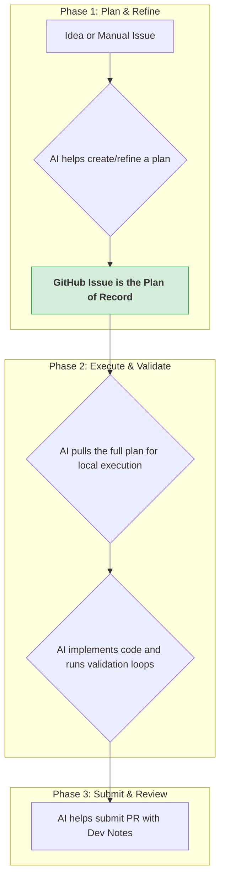

# Context Engineering Toolkit

**The definitive solution to AI coding assistant failures.** Context Engineering transforms unreliable AI assistants into consistent, pattern-following development partners through systematic context provision.

> **Context Engineering is 10x better than prompt engineering and 100x better than vibe coding.**

[](https://npmjs.com/package/context-engineering-installer)
[](https://github.com/tazomatalax/context-engineering/issues)
[](https://opensource.org/licenses/MIT)

**🎯 The Problem:** AI assistants hallucinate libraries, ignore patterns, break tests  
**💡 The Solution:** Systematic context engineering with validation loops  
**📈 The Result:** AI that follows your conventions and passes quality gates

## 🚀 Quick Start

### 1. Install the Toolkit

**Choose your runtime:**

```bash
# Python runtime (recommended - no Node.js required)
uvx context-engineering-installer

# Node.js runtime
npx context-engineering-installer
```

Both installers will:
- Prompt you to confirm runtime choice
- Copy all necessary files to your project
- Set up `.claude/commands/` for Claude Code  
- Create `.env.example` for GitHub integration

**Environment variable override:**
```bash
# Force a specific runtime without prompting
RUNTIME=python npx context-engineering-installer
RUNTIME=node npx context-engineering-installer
```

**Note:** You must run this from within a git repository.

**Option B: Legacy bash installer (deprecated)**
```bash
# This method is deprecated and will be removed in future versions
curl -fsSL https://raw.githubusercontent.com/tazomatalax/context-engineering/main/install.sh | bash
```

### 2. Configure Environment

```bash
# Copy and edit environment file
cp .env.example .env
# Edit .env with your GitHub credentials:
#   GITHUB_TOKEN=your_github_personal_access_token
#   GITHUB_REPO=owner/repo-name
```

### 3. Install Runtime Dependencies

**For Python runtime:**
```bash
curl -LsSf https://astral.sh/uv/install.sh | sh
uv pip install requests
```

**For Node.js runtime:**
```bash
npm install @octokit/rest dotenv
```

### 2. Draft a Plan from an Idea

```bash
# In Claude Code, describe your goal
/create-task "Add a dark mode toggle to the settings page"
```

This creates a detailed plan in `temp/task-draft-{timestamp}.md`.

### 3. Review and Post the Plan

```bash
# Review and edit the draft file, then post it to GitHub
# Commands auto-detected based on installed runtime:

# Python runtime:
uv run scripts/post_issue.py temp/task-draft-{timestamp}.md

# Node.js runtime:
node scripts/post-issue.cjs temp/task-draft-{timestamp}.md
```

### 4. Start the Task

```bash
# This fetches the full plan (issue + comments) into a local file
/start-task --issue=123
```

### 5. Execute and Submit

```bash
# The AI implements the plan, running ./validate.sh until it passes
/execute-prp PRPs/active/123-add-dark-mode-toggle.md

# Finally, submit the completed work as a Pull Request
/submit-pr --issue=123
```

### The Plan → Execute → Submit Workflow

Context Engineering follows a streamlined **Plan → Execute → Submit** workflow that prioritizes team collaboration and real-world usability.

## 📚 Table of Contents

- [What is Context Engineering?](#what-is-context-engineering)
- [The Plan → Execute → Submit Workflow](#the-plan--execute--submit-workflow)
- [Installation and Setup](#installation-and-setup)
- [Command Reference](#command-reference)
- [Toolkit Structure](#toolkit-structure)
- [Best Practices](#best-practices)
- [Advanced Features](#advanced-features)
- [Contributing](#-contributing)

## What is Context Engineering?

Context Engineering represents a paradigm shift from traditional prompt engineering:

### Prompt Engineering vs Context Engineering

**Prompt Engineering:**
- Focuses on clever wording and specific phrasing
- Limited to how you phrase a task
- Like giving someone a sticky note

**Context Engineering:**
- A complete system for providing comprehensive context
- Includes documentation, examples, rules, patterns, and validation
- Like writing a full screenplay with all the details

### Why Context Engineering Matters

1. **Reduces AI Failures**: Most agent failures aren't model failures - they're context failures
2. **Ensures Consistency**: AI follows your project patterns and conventions
3. **Enables Complex Features**: AI can handle multi-step implementations with proper context
4. **Self-Correcting**: Validation loops allow AI to fix its own mistakes

## The Plan → Execute → Submit Workflow

The new workflow prioritizes **real-world usability, safety, and collaboration** over rigid automation:

### Workflow Visualization



### Workflow Commands

#### For New Tasks (Plan from Scratch):
```bash
# 1. Create comprehensive task from minimal prompt
/create-task "Add dark mode toggle to settings"

# 2. Edit the generated draft, then post to GitHub
node scripts/post-issue.js temp/task-draft-{timestamp}.md

# 3. Fetch complete context and start implementation  
/start-task --issue=123

# 4. Execute the comprehensive plan
/execute-prp PRPs/active/123-feature-name.md

# 5. Submit with AI-generated developer notes
/submit-pr --issue=123
```

#### For Simple Manual Issues (Refine Existing):
```bash
# 1. Refine a simple issue created by PM/teammate
/refine-task --issue=123

# 2. Fetch complete context after refinement
/start-task --issue=123

# 3. Execute the comprehensive plan  
/execute-prp PRPs/active/123-feature-name.md

# 4. Submit with AI-generated developer notes
/submit-pr --issue=123
```

### Key Advantages

- **GitHub Issues as Single Source of Truth**: The plan lives on GitHub for full team visibility
- **Minimally Invasive Installation**: Safe file deployment without project analysis
- **AI-Assisted Guided Configuration**: Collaborate with AI to configure for your specific project
- **Graceful Handling of Unstructured Inputs**: Convert simple ideas into actionable plans
- **Automate Toil, Not Thinking**: Automate repetitive tasks while keeping humans in control

## Installation and Setup

### 1. Install the Toolkit

**Method 1: Universal Installer (Recommended - No Node.js required)**

```bash
# Navigate to your project directory
cd your-existing-project

# Install via curl (Linux/macOS/WSL)
curl -fsSL https://raw.githubusercontent.com/tazomatalax/context-engineering/main/install.sh | bash

# OR clone and install locally (works everywhere)
git clone https://github.com/tazomatalax/context-engineering.git
cd context-engineering && ./install.sh

# Windows users: Use install.bat instead
install.bat
```

**Method 2: NPX Installer (Node.js required)**

```bash
# In your existing project directory
npx context-engineering-installer

# To uninstall later if needed
npx context-engineering-installer --uninstall
```

**Why Universal Installer?**
- ✅ Works without Node.js/npm installed
- ✅ More reliable on different platforms
- ✅ Uses shell scripts instead of Node.js dependencies
- ✅ Simpler error handling and debugging

### 2. Configure Environment

```bash
# Copy environment template
cp .env.example .env

# Edit with your GitHub credentials
GITHUB_TOKEN=your_personal_access_token_here
GITHUB_REPO=owner/repo-name
```

**Creating a GitHub Personal Access Token:**
1. Go to GitHub Settings → Developer settings → Personal access tokens
2. Generate a new token with `repo` scope
3. Copy the token to your `.env` file

### 3. Configure Validation Script

The installer creates a generic `validate.sh` template. Configure it for your project:

```bash
# For Node.js projects, uncomment:
# npx eslint .
# npm test

# For Python projects, uncomment:
# ruff check .
# pytest
```

Your AI assistant can help configure this script for your specific project needs.

## Command Reference

### `/create-task "Brief description"`
Creates a comprehensive GitHub issue draft from a minimal prompt.

- **Input**: Brief description of desired feature
- **Output**: Detailed issue draft in `temp/task-draft-{timestamp}.md`
- **Next Step**: Edit draft, then run `node scripts/post-issue.js temp/task-draft-{filename}`

### `/refine-task --issue=<number>`
Converts simple, manually-created GitHub issues into actionable plans.

- **Input**: Issue number of existing simple issue
- **Output**: Detailed implementation plan posted as comment on the issue
- **Use Case**: When PM/team member creates basic issue that needs technical enrichment

### `/start-task --issue=<number>`
Fetches complete GitHub issue context (including all comments) for local execution.

- **Input**: Issue number with comprehensive plan
- **Output**: PRP file in `PRPs/active/{issue-number}-{title}.md` with full context
- **Next Step**: `/execute-prp PRPs/active/{filename}.md`

### `/execute-prp <path-to-prp-file>`
Executes a PRP file to implement the feature.

- **Input**: Path to PRP file with comprehensive requirements
- **Process**: AI reads context, creates plan, implements code, runs validation
- **Quality Gate**: Must pass `./validate.sh` before completion

### `/validate-execution <path-to-prp-file>` (Optional)
AI-powered logical review of implemented code against the plan.

- **Input**: Path to original PRP file
- **Process**: Reviews git diff, checks for logical flaws, suggests improvements
- **Output**: Detailed code review report with actionable feedback

### `/submit-pr --issue=<number>`
Creates a pull request. By default, auto-embeds the PRP's Implementation Notes in the PR body (single source of truth, minimal tokens).

- **Input**: Issue number of completed implementation
- **Process**:
    - Extracts `## 🛠️ Implementation Notes` from the matching PRP and embeds verbatim
    - Optionally includes additional Developer Notes via `--notes-file`
    - Creates PR and links to issue
- **Flags**: `--no-prp-notes`, `--collapse-prp-notes`, `--notes-file=...`
- **Output**: Pull request containing execution notes for reviewers

## Toolkit Structure

### Directory Structure Created by Installer

```
your-project/
├── .claude/
│   └── commands/
│       ├── create-task.md        # Creates comprehensive issue drafts
│       ├── refine-task.md        # Enriches simple issues
│       ├── start-task.md         # Fetches complete context
│       ├── execute-prp.md        # Implements features
│       ├── validate-execution.md # Optional code review
│       └── submit-pr.md          # Submits with dev notes
├── .github/
│   ├── ISSUE_TEMPLATE/
│   │   └── feature-request.yml   # Structured issue template
│   └── PULL_REQUEST_TEMPLATE.md  # PR template
├── scripts/
│   ├── generation/
│   │   └── generate-from-issue.js # Fetches issues and creates PRPs
│   └── submission/
│       └── submit-pr.js          # Creates PRs with dev notes
├── PRPs/
│   ├── active/                   # Generated PRPs for development
│   └── templates/
│       └── prp_base.md          # Base PRP template
├── temp/                         # Temporary issue drafts
├── advanced_tools.md             # Optional AI power-ups guide
├── .env.example                  # Environment template
└── validate.sh                   # Quality gate script (configure required)
```

### Key Files Explained

**`validate.sh`**: Quality gate script that must pass before work is considered complete. Configure with your project-specific linting, testing, and validation commands.

**`advanced_tools.md`**: Guide for optional AI power-ups like live documentation access (Context7) and web search (Brave Search).

**`.env.example`**: Template for environment variables including GitHub credentials.

## Best Practices

### 1. Configure Your Quality Gates
- Customize `validate.sh` with your project's linting and testing commands
- Include type checking, formatting, and any project-specific validations
- AI will iterate until all quality gates pass

### 2. Use GitHub Issues as Source of Truth
- All planning happens in GitHub issues for team visibility
- Use `/create-task` for comprehensive planning from minimal prompts
- Use `/refine-task` to enrich simple issues from team members

### 3. Leverage the Complete Context
- `/start-task` fetches not just the issue but all comments and discussion
- This ensures AI has the complete conversation context
- Implementation plans from `/refine-task` are included automatically

### 4. Review AI-Generated Developer Notes
- `/submit-pr` auto-embeds PRP Implementation Notes; pass `--notes-file` to add curated notes
- These notes help human reviewers understand changes quickly
- Review and edit PR content as needed before merging

### 5. Customize for Your Project
- Update `CLAUDE.md` with your specific conventions and patterns
- Add examples in your codebase for AI to follow
- The generic toolkit adapts to your specific needs

## Advanced Features

### Optional AI Power-Ups

Enable advanced AI capabilities by following the guide in `advanced_tools.md`:

**🧠 Live Documentation (Context7)**
- Always uses latest, most accurate library documentation
- No API key required, hosted server
- Highly recommended for all projects

**🌐 Web Search (Brave Search)**  
- Research topics and find information not in codebase
- Requires free API key from Brave Search
- Useful for complex integrations and research tasks

### Validation Script Customization

The `validate.sh` script can be enhanced with:
- Code coverage requirements
- Security scanning
- Performance benchmarks
- Database migration checks
- Custom project-specific validations

### Multiple Project Types

The toolkit works with any project type:
- **Node.js/TypeScript**: ESLint, Prettier, Jest/Vitest
- **Python**: Ruff, MyPy, Pytest
- **React**: Component patterns and testing
- **Full-stack**: Frontend + backend validation
- **Custom**: Add your own validation commands

## 🤝 Contributing

Context Engineering is an evolving discipline. Your contributions help improve AI-assisted development for everyone.

### Ways to Contribute

- **🐛 Report Issues**: Found a workflow that doesn't work? [Create an issue](https://github.com/tazomatalax/context-engineering/issues)
- **💡 Suggest Features**: Ideas for new commands or workflow improvements
- **📝 Improve Documentation**: Better examples, clearer explanations, more use cases
- **🔧 Code Contributions**: Enhance scripts, add validation patterns, improve templates
- **🧪 Test Edge Cases**: Try the toolkit on different project types and report findings

### Development Setup

```bash
# Clone and setup
git clone https://github.com/tazomatalax/context-engineering.git
cd context-engineering

# Install dependencies 
npm install

# Test the installer locally
node installer/index.js --local-test
```

### Project Structure for Contributors

```
context-engineering/
├── installer/                    # NPM package for toolkit installation
│   ├── templates/               # Files copied to user projects
│   └── index.js                # Installation logic
├── examples/                    # Reference implementations
├── docs/                       # Additional documentation
└── scripts/                    # Development and testing scripts
```

**🎯 Contribution Focus Areas:**
- Validation patterns for different frameworks
- AI command improvements and new workflow steps
- Integration with additional development tools
- Documentation and examples for diverse project types

## Resources

- [Claude Code Documentation](https://docs.anthropic.com/en/docs/claude-code)
- [GitHub Personal Access Tokens](https://github.com/settings/tokens)
- [Context Engineering Best Practices](https://www.philschmid.de/context-engineering)
- [Contributing Guidelines](CONTRIBUTING.md)

## Troubleshooting

### Common Issues

**"GITHUB_TOKEN is required"**
- Ensure `.env` file exists with valid GitHub token
- Token needs `repo` scope for private repositories

**"validate.sh not executable"**
- Run `chmod +x validate.sh` on Unix systems
- On Windows, this is usually not needed

**"No changes to commit"**
- Ensure you've implemented code changes before running `/submit-pr`
- Or switch to your existing feature branch before running `/submit-pr`
- Check `git status` to see current changes

**Script Usage Errors**
- Always use the exact format: `/submit-pr --issue=123`
- Scripts work from any directory within your project
- Environment variables are automatically detected from project root
- Use `--notes-file=temp/pr-notes.md` for optional curated Developer Notes

**Installation fails**
- Ensure you're in a project directory (not empty folder)  
- Check that you have write permissions in the directory
- For universal installer: ensure `curl` or `wget` is installed
- For Windows: ensure PowerShell execution policy allows downloads

**Want to remove the toolkit?**
- NPX method: `npx context-engineering-installer --uninstall`
- Universal method: Remove files manually using the file list from installation output
- The uninstaller will show exactly what will be deleted before proceeding

**Scripts not working?**
- Universal installer creates platform-specific validation scripts (`validate.sh` for Unix, `validate.bat` for Windows)
- Scripts auto-detect project types and use appropriate tools
- All dependencies are clearly listed and validated before running

For more help, check the toolkit files or [create an issue](https://github.com/tazomatalax/context-engineering/issues) in the repository.

---

**Made with ❤️ by developers who got tired of fixing AI hallucinations.**  
*Star this repo if Context Engineering improved your AI coding experience!*